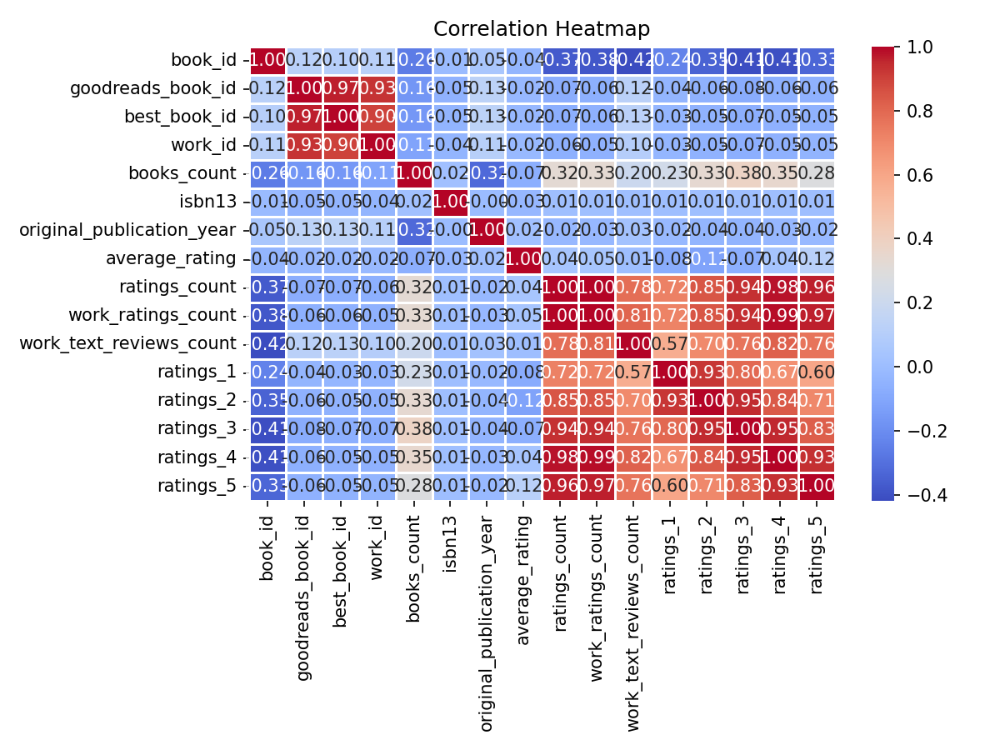
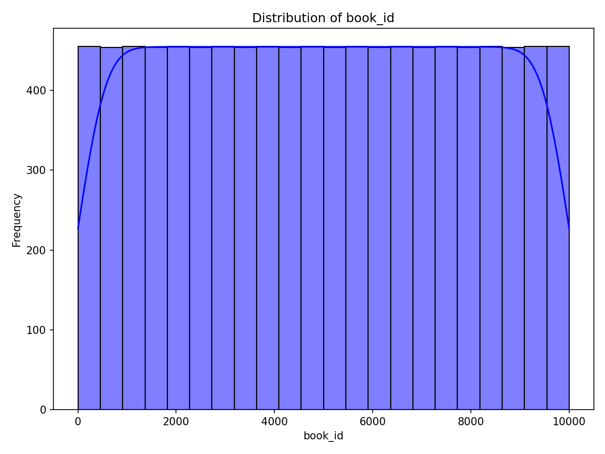
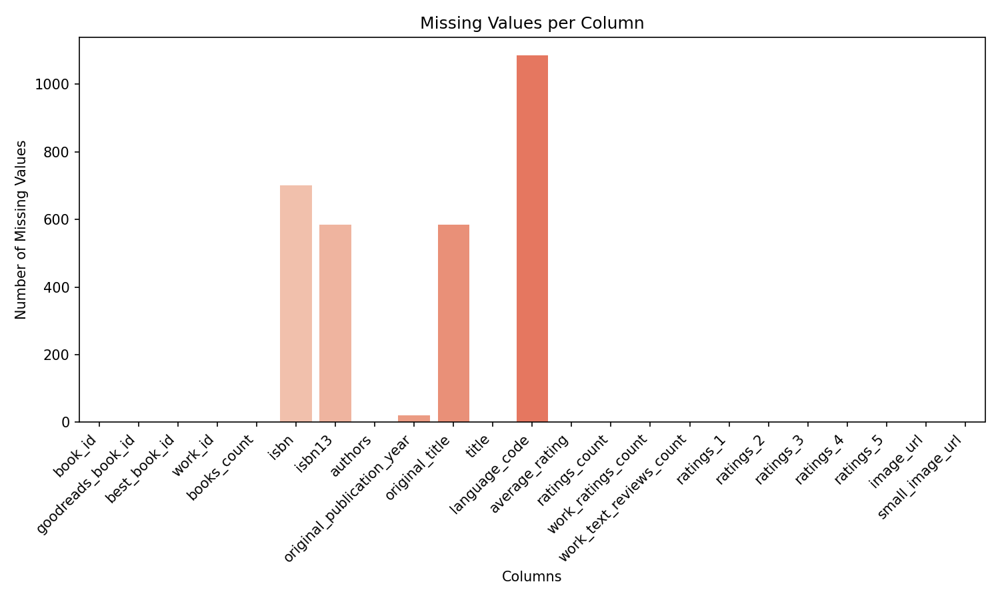

# Analysis of Book Dataset

## Overview
This dataset appears to represent a collection of books, likely sourced from an online platform such as Goodreads. It contains various metadata about each book including unique identifiers, authors, publication years, ratings, and images. With the attributes provided, we can glean insights into the popularity of authors, trends in book publications, and reader preferences across different languages.

## Analysis Steps

To derive insights from the dataset, we conducted several analytical steps:

1. **Summary Statistics**:
   - We generated basic statistics to understand the structure of the data, including the distribution of numerical columns and the count of unique values.
  
2. **Missing Value Assessment**:
   - We identified missing values across various columns, noting key attributes like `isbn`, `isbn13`, `original_publication_year`, `original_title`, and `language_code`, to determine how they might impact our analysis.

3. **Correlation Analysis**:
   - A correlation matrix was constructed to explore relationships among numeric variables, helping us identify notable correlations in ratings and counts.

4. **Clustering**:
   - We applied clustering techniques to categorize books based on their attributes, which might reveal patterns and similarities among books and authors.

## Key Insights

Through our analyses, we discovered several notable insights:

- **Diversity of Authors**: The dataset features **4,664 unique authors**, suggesting a rich variety in literary contributions.
  
- **Publication Year Trends**: There are gaps in the `original_publication_year`, indicating that the dataset includes a mix of classic and contemporary books. Trends in publication years can reveal insights into literary trends over time.

- **Language Distribution**: The presence of **26 unique languages** indicates that the dataset is globally diverse, appealing to a broad audience.

- **High Ratings Across the Board**: The average rating for books in this dataset hovers around **4.00**, demonstrating a trend of generally positive reader reception.

- **Author Popularity**: A ranking of authors based on `ratings_count` highlights who the most popular authors are, potentially guiding recommendations.

### Notable Correlations

- We observed a strong correlation between the `ratings_count` and `work_ratings_count`, suggesting that books that receive more ratings tend to have higher overall work ratings.

- The correlation matrix revealed clusters of related features, which indicated groupings among certain types of books and their ratings.

### Missing Values

Our missing values analysis identified multiple columns with missing data, notably `isbn`, `isbn13`, `original_publication_year`, and `original_title`. Understanding how these missing values affect our dataset and considering imputation or alternative methodologies is essential for robust analyses.

## Implications of Insights

The findings from our analysis can inform various strategic initiatives, including:

- **Marketing Campaigns**: With knowledge of popular authors and trending publication years, campaigns can be targeted to specific demographics and interests.

- **Recommendation Systems**: The insight gained from clustering and correlations can enhance recommendation algorithms, leading to better personalized book suggestions for users.

- **Collection Development**: Libraries and bookstores could use the insights on language diversity and publication trends to develop more inclusive and relevant collections that cater to their communities.

- **Future Research**: The dataset opens doors for further study into genre popularity and thematic analysis, allowing for deeper understanding of reader preferences.

Our analysis serves as a foundation for ongoing exploration and data-driven decision-making in the literary field. The integration of visualizations helps communicate these insights more effectively.

