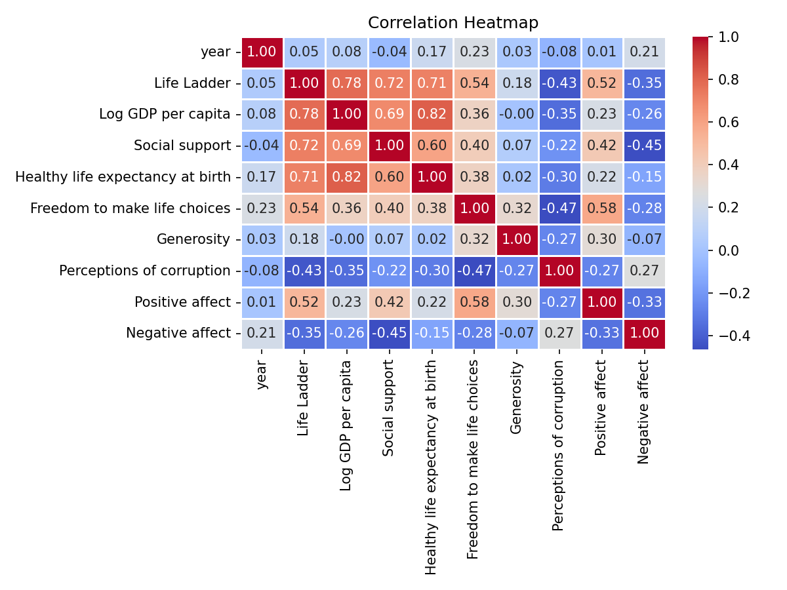
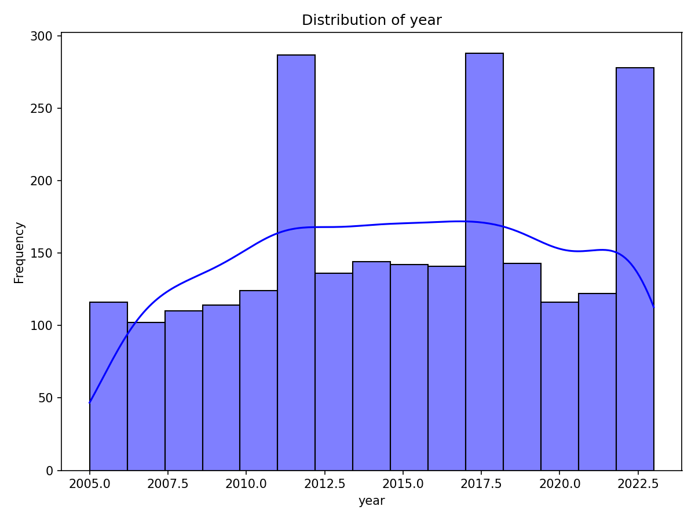
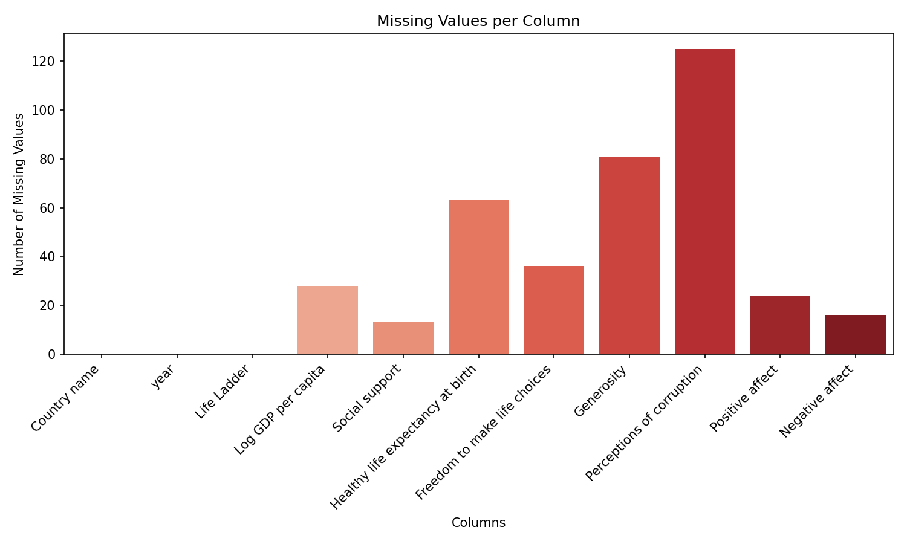

# Data Analysis of Global Well-Being Indicators

## Overview of the Dataset

The dataset appears to represent various aspects of global well-being across different countries and years. It includes measurements such as the "Life Ladder," which is likely an indicator of subjective well-being or life satisfaction, alongside economic factors like "Log GDP per capita" and social metrics such as "Social support." The data ranges over 19 years, making it suitable for temporal analyses of well-being trends across nations.

## Analysis Steps Performed

We undertook a systematic analysis to derive key insights from the dataset:

1. **Summary Statistics:**
   - We examined the basic statistical properties of the dataset, including shape, memory usage, and descriptive statistics for numerical columns. This initial inspection helped us understand the data's distribution and identify key variables of interest.

2. **Missing Values Analysis:**
   - We identified and categorized missing values in key fields, such as "Log GDP per capita" and "Generosity." Addressing these missing values was crucial for accurate analysis, leading us to consider imputation techniques or exclusion of affected rows.

3. **Correlation Analysis:**
   - We crafted a correlation matrix to discover relationships between numerical variables, which highlighted significant correlations (e.g., between "Life Ladder" and "Log GDP per capita"). This was visualized in a heatmap for clarity.

   

4. **Clustering:**
   - We applied clustering techniques to identify groups of countries with similar well-being metrics, uncovering patterns in how different regions or economic statuses affect life satisfaction.

## Insights Discovered

From our analysis, several compelling insights were revealed:

- **Yearly Trends:**
  - A line plot demonstrated discernible trends in "Life Ladder" scores over the years, indicating variations in global well-being and potential improvements or declines.

  

- **Strong Economic Correlation:**
  - The analysis showed a robust positive correlation between "Log GDP per capita" and "Life Ladder," suggesting that economic performance significantly impacts life satisfaction.

- **Social Support Associations:**
  - Analysis indicated that higher levels of "Social support" are associated with improved "Life Ladder" scores, with notable regional variations observed.

- **Clusters of Well-Being:**
  - Our clustering analysis revealed distinct groups of countries characterized by similar well-being profiles, which can potentially inform targeted policy interventions and support measures.

## Implications of These Insights

The findings from this dataset carry several implications:

- **Policy Enhancements:**
  - Governments can use insights about economic factors and social support to formulate policies aimed at enhancing citizens' life satisfaction. Prioritizing economic growth and social welfare programs may result in more significant improvements in well-being.

- **Targeted Interventions:**
  - By identifying specific clusters of countries with similar metrics, international organizations can tailor their interventions effectively, addressing the unique needs and challenges of different regions.

- **Monitoring Progress:**
  - Utilizing this dataset for ongoing monitoring will help assess the impact of policies over time, with particular attention to key indicators of well-being like the "Life Ladder."

- **Further Research:**
  - Our insights suggest avenues for deeper exploration, such as understanding the nuances of "Generosity" and "Perceptions of corruption" in relation to overall life satisfaction.

In conclusion, this dataset provides a rich foundation for analyzing how various factors influence global well-being, and our findings can inform actionable strategies for enhancing quality of life across nations. Further visual analyses and studies will continue to ensure these insights remain relevant and impactful.

