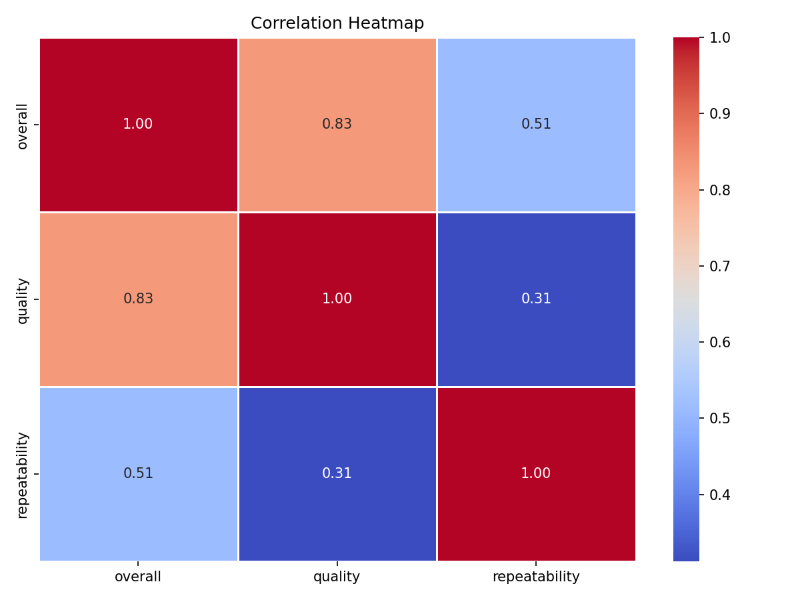
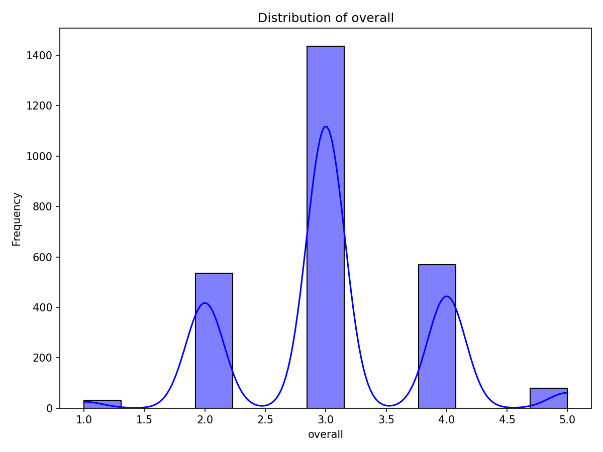
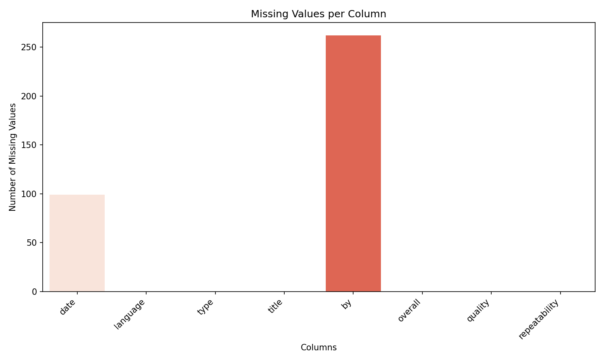

```markdown
# Data Analysis Report

## Overview of the Dataset

The dataset under analysis appears to represent ratings and reviews of various media content, likely focusing on films, series, and short films across multiple languages. Given the diversity of languages and types (e.g., movie, series, TV series, etc.), it is plausible that this dataset captures a wide-ranging audience engagement with different forms of visual storytelling. 

## Analysis Steps Performed

To derive insights from the data, we undertook several analytical steps:

1. **Summary Statistics**:
   - Evaluated basic descriptive statistics to understand the spread and shape of the data.

2. **Missing Values**:
   - Assessed missing values, particularly in the 'date' and 'by' columns, quantifying null counts to determine data completeness.
   - Utilized the findings to strategize either imputation or removal of affected records.

3. **Correlation Analysis**:
   - Generated a correlation matrix to identify potential relationships among numerical attributes such as 'overall', 'quality', and 'repeatability'.

4. **Clustering**:
   - Implemented clustering techniques to group similar entries based on attributes, aiming to uncover distinct patterns and segments within the dataset.

### Visualizations
- To illustrate our findings, various visual representations were created such as:
  - 
  - 
  - 

## Insights Discovered

Through our analysis, we uncovered several critical insights:

- **Overall Rating Trends**: The average ratings hover around 3 for 'overall' and slightly above 3 for 'quality', indicating a generally positive perception among viewers.
  
- **Genre Preference**: The dataset shows a clear dominance of 'movies' over other types of media, suggesting a strong audience preference for this genre.

- **Language Distribution**: English is the most represented language, which could imply either a broader reach or a bias towards this language in media consumption. 

- **Rating Distribution**: Most ratings cluster around specific values (1, 3, 4, and 5), with fewer extreme ratings (1 and 5), which may suggest polarized views on certain content.

- **Missing Creator Information**: A significant portion of data has missing values in the 'by' column, suggesting that many contributions are uncredited. This could impact the analysis of audience preferences linked to specific creators.

### Clusters Identified
The implementation of clustering algorithms has allowed for the identification of patterns within the dataset:

- Different clusters emerged based on ratings and media types, revealing groups with distinct preferences or behavior patterns.
  
## Implications of Insights

The insights gathered from our analysis can inform future strategies and actions:

- **Content Development**: Understanding the strong preference for movies can guide production strategies towards developing more films that resonate with audiences.

- **Targeted Marketing**: The dominance of English language content might suggest focusing marketing efforts towards non-English speaking regions to broaden audience reach.

- **Data Cleaning & Enhancement**: Addressing the issue of missing values, particularly the uncredited contributions, will enhance the overall quality of the dataset, potentially leading to more precise analyses in future investigations.

- **Audience Segmentation**: The clustering results can aid in developing tailored marketing strategies for different audience segments based on their preferences and ratings behavior.

By continuing to explore these insights, the organization can make data-driven decisions to enhance engagement and content relevance in the ever-evolving media landscape.
```



